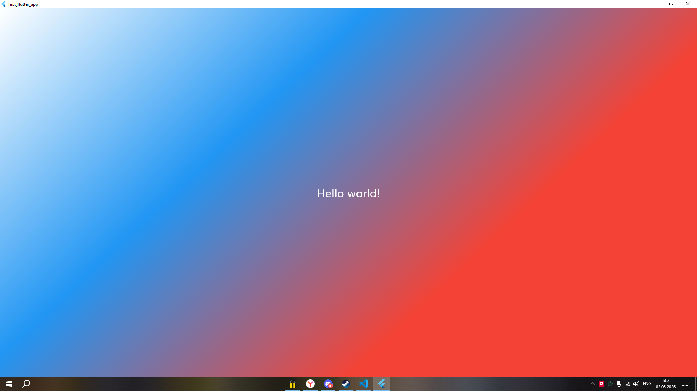

# Flutter Lab 2 - Знакомство с Flutter

Проект создан в рамках лабораторной работы №2 по изучению основ кроссплатформенной разработки на Flutter. Приложение демонстрирует базовые концепции фреймворка: виджеты, дерево виджетов и работу с UI.

## Информация об авторе

**Выполнил:** Шапкин  
**Группа:** ИСП-232

## Стек и версии

- **Flutter**
- **Dart**
- **Платформа:** Web (Chrome)
- **IDE:** VS Code

## Скриншот приложения

5

## Запуск

1. Клонировать репозиторий:
   ```bash
   git clone <URL_вашего_репозитория>

2. Перейти в папку проекта:
   ```bash
    cd Flutter_Lab2
3. Установить зависимости:
   ```bash
    flutter pub get
4. Запустить приложение:
   ```bash
    flutter run -d chrome
## Что изучили
В ходе выполнения лабораторной работы были изучены:
1. Основы Flutter — структура проекта, создание и запуск Flutter-приложения в браузере Chrome
2. Виджеты — базовые строительные блоки UI: MaterialApp, Scaffold, Center, Text, Container
3. Дерево виджетов — иерархическая структура вложенности виджетов и принципы их композиции
4. Стилизация интерфейса — работа с цветами (Colors, const Color), градиентами (LinearGradient), оформление текста (TextStyle)
5. Инструменты разработки — Hot Reload vs Hot Restart, Flutter DevTools, Flutter Inspector, работа с VS Code
# Структура проекта
   ```bash
    Flutter_Lab2/
    ├── lib/
    │   └── main.dart          # Основной код приложения
    ├── img/                   # Скриншоты приложения
    ├── web/                   # Веб-точка входа
    ├── pubspec.yaml           # Манифест проекта
    └── README.md              # Этот файл
```


